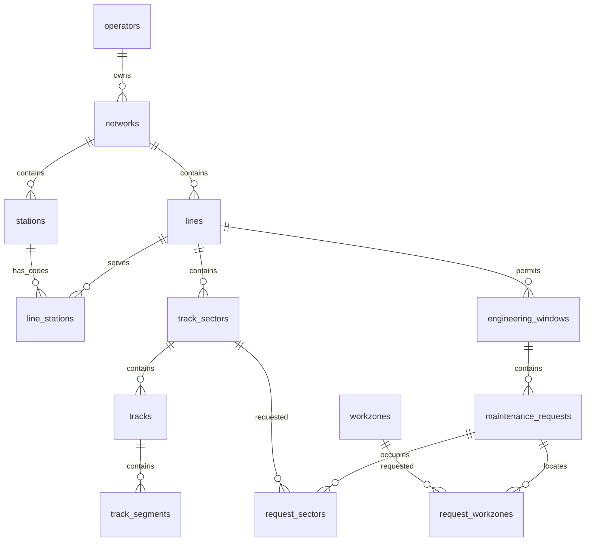
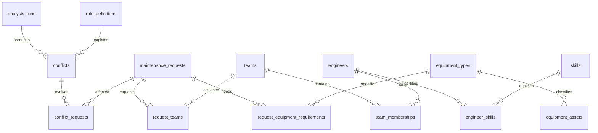
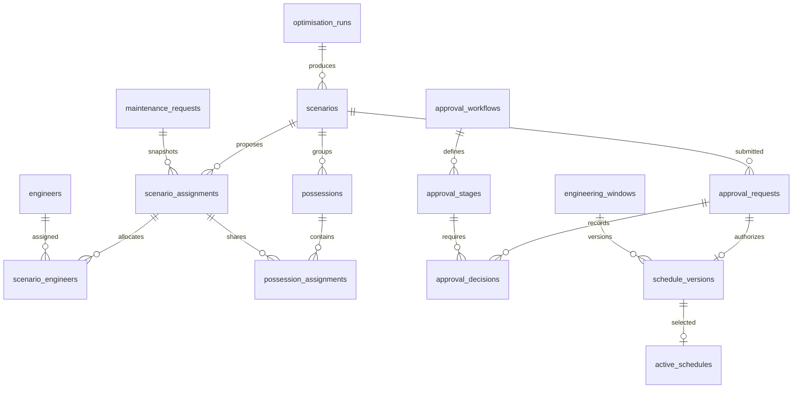
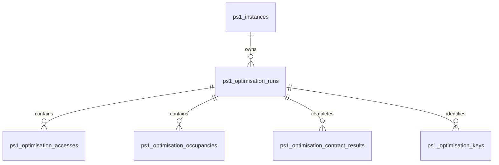
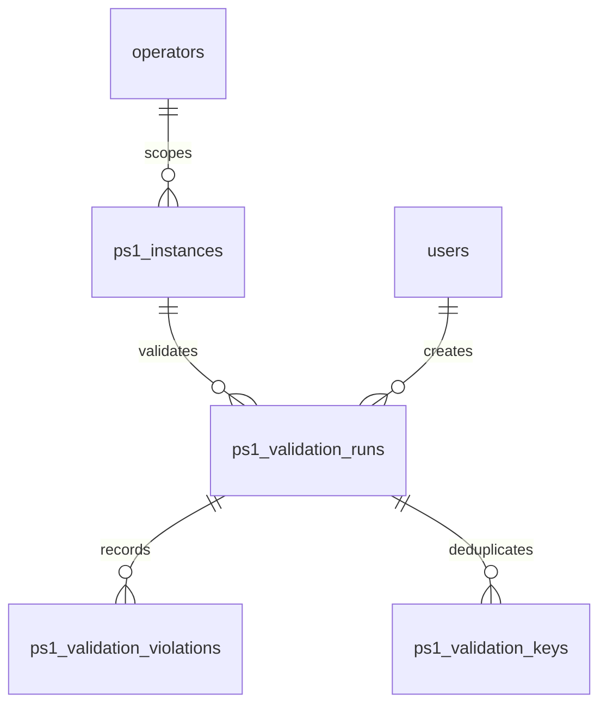

# RailPlan domain ER diagrams

Scenario B reuses the sealed `ps1_optimisation_runs` parent and its access, occupancy, contract-result, and idempotency-key children. `scenario` discriminates A/B; `ps1_optimisation_accesses.eclo` retains `0/1`. Workload, excess, stage, policy, and validation structures remain immutable JSON snapshots on the parent.

These are relationship-level diagrams. Full columns and subsidiary junctions are in DATA_DICTIONARY.md.

## Network and requested intent

## Resource and conflict evidence

## Alternatives and approved history

## Relationship notes

Scenario A optimisation reads an operator-scoped immutable `ps1_instances.dataset` and
saves a terminal rich result in dedicated migration-0007 tables. Physical mappings are
not sent through CSV-only validation history. All child rows share operator/instance FKs.

An optional run-to-baseline FK is constrained to the same operator and instance.
Accepted occupancy rows also reference their activity/week access. Creation-transaction
and manifest guards plus deferred checks seal the parent and all child content at commit.
See PS1_OPTIMISATION_PERSISTENCE.md for the full transaction and audit design.

### PS1 immutable history (migration 0006)

Composite parent/operator foreign keys prevent cross-operator child records. All three
validation tables are append-only with audited inserts. PS1 is not linked to legacy
nightly requests or severity scores.

- A request may need many sectors/resources and may have many proposed assignments, one per scenario.
- A conflict belongs to one analysis run but may involve any number of requests/resources.
- An analysis run optionally targets a scenario; NULL means original requested timings.
- Many compatible jobs may share one possession. The possession link checks scenario identity and containment.
- Request locks are independently owned/time-stamped records with relational locked-field definitions.
- Approval decision history and schedule snapshots are append-only. An active pointer is distinct from historical versions.
- Dependencies use predecessor/successor FK pairs and type-specific lag. Cycles require future validator checks.
